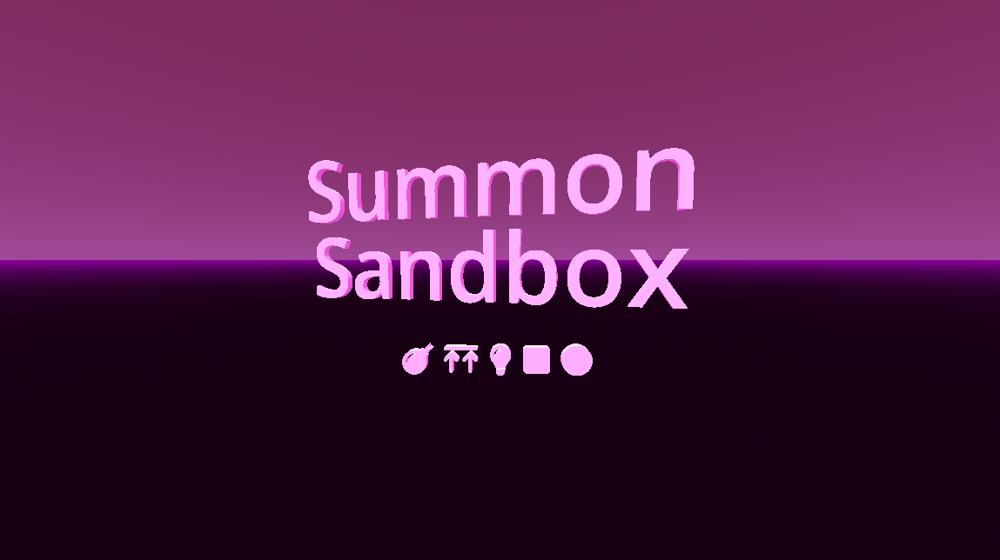

# Summon Sandbox - Ludum Dare 55

|             |                                                                                |
|-------------|--------------------------------------------------------------------------------|
| **Theme**   | _Summoning_                                                                    |
| **Date**    | _April 2024_                                                                   |
| **Type**    | _Compo_                                                                        |
| **Concept** | _A simple FPS with a twist._                                                   |

**:rocket: [Play it here!](https://srynetix.github.io/summon-sandbox/)**

Welcome on my 9th **Ludum Dare** Compo entry!

Well... I was not really inspired by the theme, but I wanted to do one thing: a 3D FPS game!
And things were not as expected to say the least. :smile:

That's my second released 3D game (first one for Ludum Dare #48: https://ldjam.com/events/ludum-dare/48/deep-space-beat), and I encountered every problem possible.
Light issues, modeling issues, CSG issues, texture issues, shader issues, game logic issues... most of which were only my fault and not the engine.

So, in the end, I did a **3D FPS** game/demo where you need to escape using a mysterious object you can use to _summon_ the solution. :wink:
There are no clear objectives in this game, that's why I named it "sandbox" (it will be clearer at the end of the game).

I did by best with the available time for HTML5 support, so it should work, but expect stutter sometimes (and forget about it on MacOS).
For a better experience, you might want to run the desktop version.

**Software used**:
- _Game Engine_: [Godot Engine 4.2.1] with my [sxgd](https://github.com/Srynetix/sxgd) plugin collection,
- _"Art"_: [Krita], [Blender] and [Pixelorama],
- _Sound effects and music track_: [FL Studio](https://www.image-line.com/fl-studio/), almost only with 3xOsc for sound effects and Kepler for the soundtrack.

**Font used**:
- Font Awesome 6

_Good luck, and have fun!_

## Preview

[Godot Engine 4.2.1]: https://godotengine.org/
[GIMP]: https://www.gimp.org/
[Blender]: https://www.blender.org/
[Pixelorama]: https://orama-interactive.itch.io/pixelorama
[Krita]: https://krita.org/fr/
